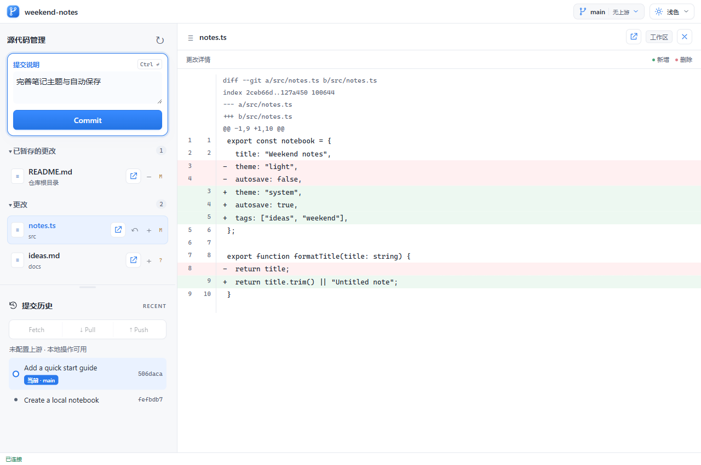
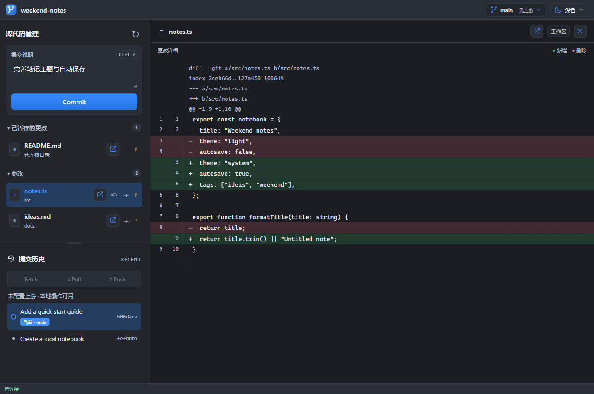

# Codex Git Panel

**Review diffs, stage files, commit changes, and sync remotes in your Codex workflow.**

[中文](README.md) · English

Git Panel is a local Codex plugin with an interactive Git interface. Ask Codex to open it, then operate Git yourself. Or configure a global **Open in** entry to open a repository from a file or folder without sending a prompt each time. Use it to review AI changes, prepare a commit, or keep local versions of notes, documents, and personal projects.



## Features

| Task | What you can do |
| --- | --- |
| Review changes | Browse staged and unstaged files, unified diffs with line numbers, and new-file previews |
| Prepare commits | Stage or unstage individual files; discard unstaged changes to tracked files after confirmation |
| Save a version | Commit with a message or `Ctrl + Enter`; keep a message draft per repository |
| Browse history | Inspect recent commits and their diffs, with current and upstream commit markers |
| Switch branches | Switch to an existing local branch when the working tree is clean |
| Sync remotes | Fetch, fast-forward-only Pull, upstream Push, and ahead/behind counts |
| Work locally | Initialize a folder and review, stage, and commit without a GitHub account or remote |
| Customize the view | Light, dark, or system theme; resizable file and history panes; open files in default Windows apps |

<details>
<summary>View dark mode</summary>



</details>

## Install and configure with Codex

Requirements: **Node.js 20+, Git, and a Codex client with plugin support**. The global Open in entry also requires a desktop client supporting `desktop.custom_file_handlers`. The launcher has been run on Windows; macOS/Linux browser launching is implemented but not runtime-verified. The panel currently uses mostly Chinese UI text with some English Git action labels.

Copy this entire prompt into Codex:

```text
Please install and configure https://github.com/bruc3van/codex-git-panel for me.

1. Read the repository README and check Node.js 20+, Git, and Codex plugin support. Clone the repository into a stable user directory, or reuse an existing installation while preserving local changes.
2. The plugin root is plugins/git-panel. Install and enable it using the local plugin/marketplace mechanism supported by this Codex version. Preserve other plugin settings; do not treat the repository root as the plugin root.
3. Also configure the global "Open in → Git Panel" entry automatically. Back up the user config.toml, respecting CODEX_HOME, and add or update desktop.custom_file_handlers.git-panel. Set command to the actual absolute Node executable path, args to the absolute scripts/open.mjs path in the stable source directory, and icon to its web/icon.svg path. Set label = "Git Panel", input = "path", and supports_ssh = false. Avoid versioned plugin cache paths, duplicate TOML tables, and changes to my preferred editor.
4. Verify TOML parsing, referenced paths, plugin installation, and that the launcher binds to the intended repository. Do not stage, commit, push, or initialize my working directories during installation. Use temporary directories for initialization tests.
5. When configuration is complete, explicitly guide me to save ongoing work, fully quit and reopen the Codex desktop client, and start a new task to load the plugin. Do not force-close the client or claim the menu works before it has been verified after restart.
6. Explain how to use "Open in → Git Panel", a natural-language prompt, and the / or $ picker to find and select the git-panel Skill after restarting. Explain that Open in uses the system default browser while the Skill prefers Codex's built-in browser. If this client does not support custom file handlers, keep the Skill installation and explain the limitation.
```

Installing the plugin and registering Open in are separate steps; this prompt asks Codex to complete both. The handler is a user-level setting shared across local projects, with no per-project Action required. After setup, **fully quit and reopen Codex, then start a new task**.

## Three ways to open the panel

### 1. The native Open in menu

After configuration and restart, choose **Open in → Git Panel** for a local file in Codex. You can also select a directory if your client offers an Open in entry for folders or projects.

The launcher finds the containing Git repository and opens it in your **system default browser**. It supports subdirectories, Unicode and spaced paths, and linked worktrees. No model call or default-editor change is needed. This adds an Open in target, not a new panel alongside Review, Terminal, Browser, and Files.

### 2. Ask Codex

```text
Open the Git panel for the current repository.
```

Or specify a repository:

```text
Open the Git panel for <local-repository-path> so I can review and commit changes manually.
```

The Skill starts the service and prefers Codex's built-in browser through the available app tool. If that tool is unavailable, it returns a local link. Opening the panel does not commit or sync changes.

### 3. The slash menu or Skill picker

Type `/` in the composer, search for `git-panel`, select the installed Skill, and send your request. You can also type `$` to find and select it. Use the name shown by your client; no Skill file path is needed. If it is missing, check that the plugin is enabled and start a new task after restarting. See [Codex slash commands](https://learn.chatgpt.com/docs/reference/slash-commands).

Both pickers invoke the Skill through Codex; they are not model-free system shortcuts.

## Start tracking a local folder

On Windows, opening a directory outside a Git repository displays a confirmation dialog with the target path. Choose **Yes** to initialize and open it, or **No** to cancel. When opening a file, the target is its containing directory.

Initialization does not stage files, create commits, or add a remote. A directory inside an existing repository uses that repository instead of creating a nested one. You can also explicitly ask Codex:

```text
Initialize <folder-path> as a local Git repository and open the Git panel. Do not create a remote or commit anything yet.
```

Git author name and email must be configured before your first commit. Local operations remain available without a remote; remote buttons are disabled when their requirements are not met.

## Commit and sync

1. Select a file to inspect its diff. Use `+` / `−` to stage or unstage files.
2. Enter a message and click **Commit**, or press `Ctrl + Enter` in the message field.
3. **If files are staged, only staged changes are committed. If nothing is staged, all changes are staged and committed.** Stage files first when you want a partial selection. If a commit fails after automatic staging, those changes remain staged.
4. When the working tree is clean and commits are ahead of upstream, the primary button becomes **Push**. Sync requires an existing upstream. Pull only fast-forwards; handle divergence, conflicts, and ongoing merges/rebases in a terminal first.

## Commands and configuration

Run these from the cloned repository, replacing placeholder paths:

```sh
# Open the containing repository in the default browser
node plugins/git-panel/scripts/open.mjs "<file-or-directory>"

# Explicitly initialize a local directory without a confirmation dialog, then open it
node plugins/git-panel/scripts/open.mjs --init "<directory>"

# Start the service and print a URL for another browser or integration
node plugins/git-panel/scripts/launch.mjs "<repository>"
```

<details>
<summary>Global Open in configuration example</summary>

Ask Codex to fill in real local paths in your user-level `config.toml`:

```toml
[desktop.custom_file_handlers.git-panel]
label = "Git Panel"
icon = "<absolute-path-to-plugin>/web/icon.svg"
command = "<absolute-path-to-node>"
args = ["<absolute-path-to-plugin>/scripts/open.mjs"]
input = "path"
supports_ssh = false
```

The plugin path is `plugins/git-panel` inside the stable source checkout. On Windows, use forward slashes or TOML literal strings for backslash paths. Update an existing handler table rather than adding a duplicate, then restart the client. See the [official configuration reference](https://learn.chatgpt.com/docs/config-file/config-advanced#add-custom-file-handlers).

</details>

## Troubleshooting

- **No menu entry:** Fully quit and reopen Codex, then check the client version, Node path, and TOML configuration. Valid configuration alone does not prove that a client supports the menu.
- **Clicking does not open the panel:** Run `open.mjs` in a terminal to see the error. Node and Git must be available locally. macOS uses `open`; Linux uses `xdg-open`. Outside Windows, initialize with `git init` or the explicit `--init` option.
- **A file will not open in its default app:** The panel's file-opening action currently supports Windows only and blocks scripts, executables, and shortcuts.
- **Authentication, signing, or Git hook errors:** The panel uses your local Git configuration. Complete interactive credential or signing setup in a terminal first.
- **Update or uninstall:** After updating the stable source checkout, ask Codex to reinstall the plugin and check the handler paths. Restart and open a new task. To remove the global entry, delete its handler table and restart; uninstall the plugin separately.

Partial-hunk staging, side-by-side diffs, branch creation, conflict resolution UI, and AI commit-message generation are not currently included. Commit diffs compare against the first parent.

## Local service and development

The service listens only on `127.0.0.1`, binds each instance to one worktree, and protects its API with a random session credential and Host/Origin checks. Do not share launch URLs containing session credentials. Closing a browser does not stop the service; the launcher reuses a live instance for the same script path and repository. Runtime records are stored in `%LOCALAPPDATA%/CodexGitPanel`, or the system temporary directory when that variable is unset. Use the PID in the matching record to stop a service.

```sh
npm start
npm test
```

Runtime dependencies are Node.js and Git. Tests use temporary repositories for Git operations, initialization, path resolution, and HTTP boundaries; they do not commit or push your working repositories. Plugin source lives in `plugins/git-panel`, with tests in `tests`.
